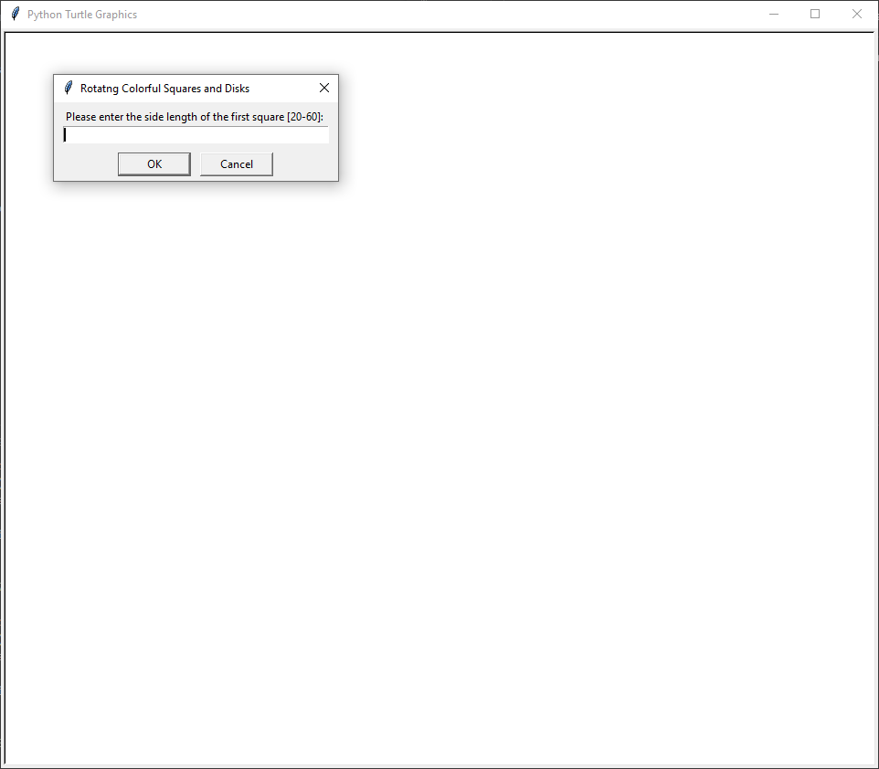
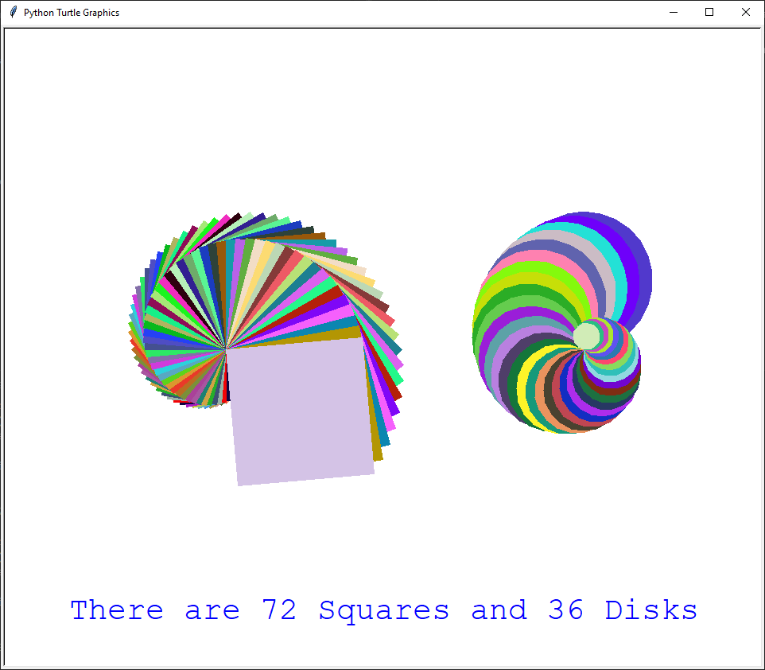

# Colors and Shapes

In this project, students have to create simple shapes (square and circle) and color it using Python's library, Turtle. The program takes a single integer input to determine the size of the shape. The color is pseudo-randomly generated. To run this program, you don't need to install any extension library. You only have to run the python file.

## Input Interface

## Program Output
