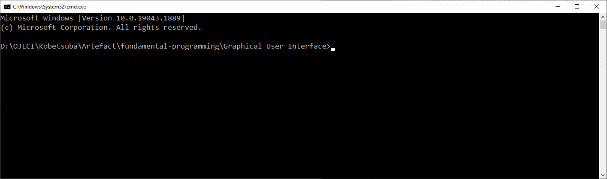
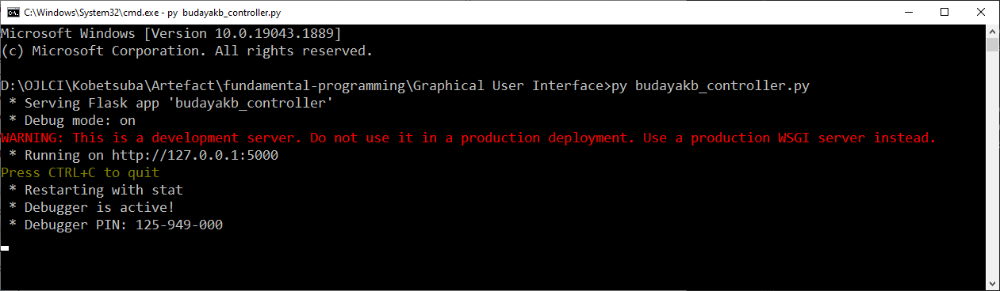

# GUI Budaya KB
This application is a more interactive version of CLI Budaya KB and more user friendly since this application has its graphical user interface. The functions of GUI Budaya KB and CLI Budaya KB are similar. Please note that this application also need a csv file with the same format as CLI Budaya KB in the same directory as `budayakb_controller`. User can import and export csv file, filter data from the csv file, and edit existing file. To run this application locally, there are some steps that you have to follow:  
1. Make sure python3 and pip have been installed in your computer.
2. Open your terminal or command prompt, and open the directory of this folder.  

3. Run `pip install -U Flask` to install Flask library from Python since this application utilize Flask.  

4. Once the installation complete, run `py budayakb_controller.py` for Windows, or `python3 budayakb_controller.py` for macOS.  

5. Open your browser and go to `127.0.0.1:5000` or `localhost:5000` to see the web page.  
