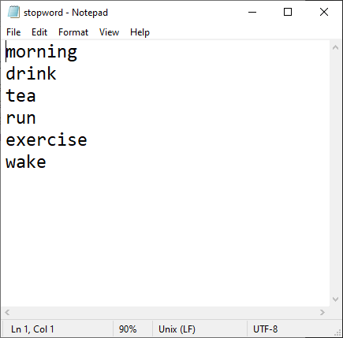
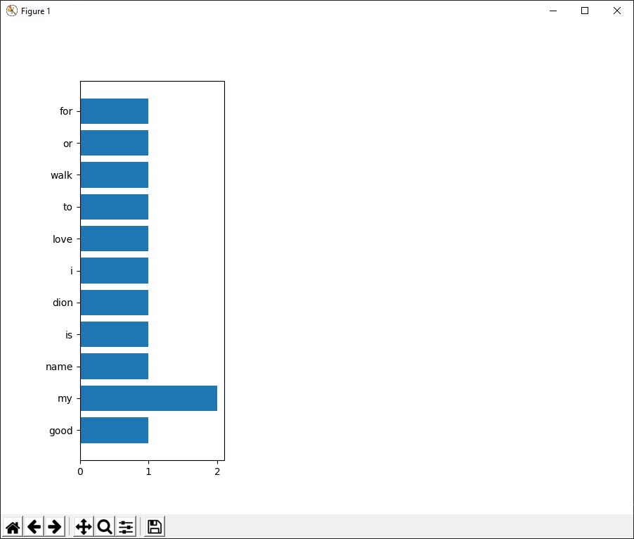

# Word Counter

The function of this code is to count the appearance of each words given from the input. The input could consist of an empty input, words, and sentences. This program requires a file called **stopword.txt** that contains list of words that will be ignored. The output of this program is sum of each words, displayed in a table and a diagram. This kind of program usually used for indicating spam messages.

## Example
### Stopwords List

### Terminal Input and Output

### Diagram Output

